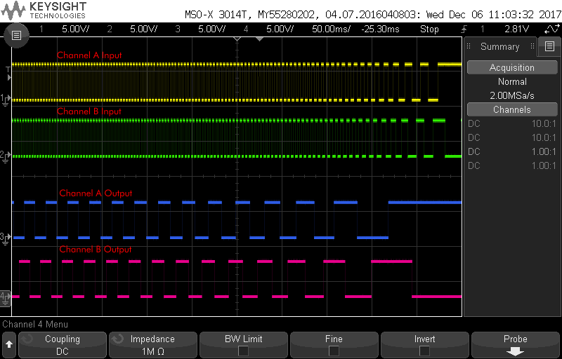

# ATtiny85 Quadrature Divider
Quadrature encoder divider for the ATtiny85.

Lowers encoder resolution so fast motor encoders can be read on slow devices (e.g. Raspberry Pi).

    Pinout
    ------
                       ATTiny85
                        ------
                      --|o   |--
    quad. B in  PB3   --|    |--   PB2  quad. B out
    quad. A in  PB4   --|    |--   PB1  quad. A out
                      --|    |--
                        ------
                        

Set `DIVIDER` in `main.c` to control how much to divide input.

### Building
    make build
    
### Building and flashing

Edit `Makefile` and set `PROGRAMMER` and `PORT`

    make
